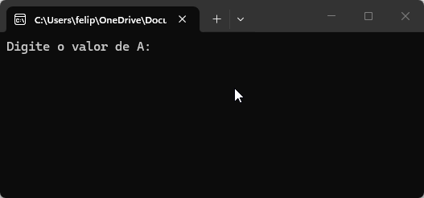
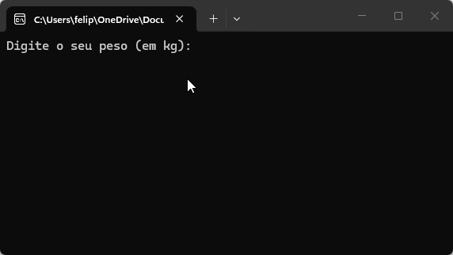
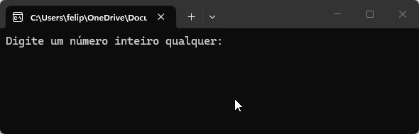
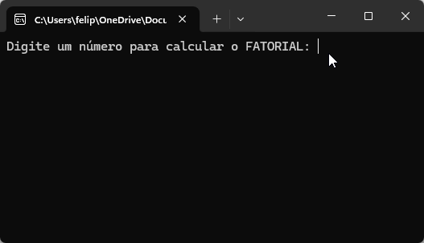
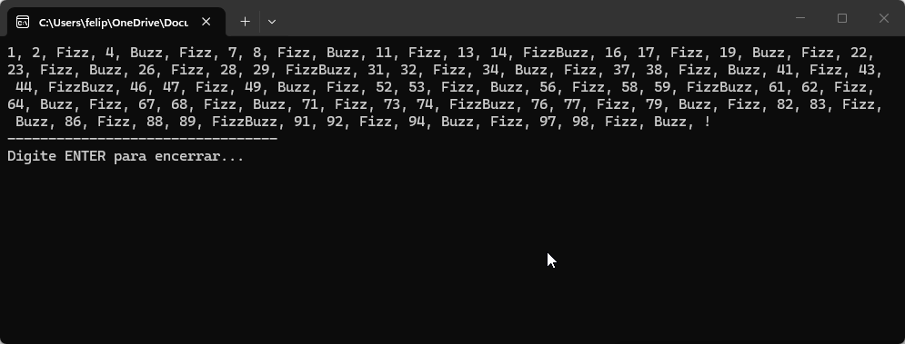

# Lista de Exercícios 01 - 02/04

## Primeira lista de exercícios realizada na [Academia do Programador](https://www.academiadoprogramador.net) 2026.

### 1. Crie um programa para calcular o volume de uma caixa retangular. ###

Fórmula para o cálculo do volume: *V = comprimento x largura x altura*;

 

### 2. Crie um programa que calcule o consumo de combustível por quilômetro percorrido em uma viagem. ###

Fórmula para o cálculo da média de consumo de combustível: 

*média de consumo de combustivel = kms Rodados / qtd Combustível utilizado durante a viagem*

 

### 3. Crie um programa para converter a temperatura da escala Celsius para a escala Fahrenheit ###

Fórmula para converter a temperatura de Fahrenheit para Celsius.

*tempFahrenheit = ((tempCelsius x 9) / 5) + 32*

 

### 4. Crie um programa para calcular o salário total de um vendedor. ### 

Deverá ser informado o salário base e o total de vendas. A comissão é calculada com um percentual (informado pelo usuário) sobre o total de vendas.

### 5. Crie um programa para calcular a média ponderada de duas provas realizadas por um aluno.

Fórmula para o cálculo da média ponderada:

*mediaPonderada = ((nota1 x peso1) + (nota2 x peso2)) / peso1 + peso2*

### 6. Faça um algoritmo que leia os valores A, B, C e imprima na tela se a soma de A + B é menor que C. ###

### 7. Um sistema que calcula o IMC de uma pessoa. ###

O IMC – Índice de Massa Corporal é um critério da Organização Mundial de Saúde para dar uma indicação sobre a condição de peso de uma pessoa adulta. 

A fórmula é *IMC = peso / (altura x altura)*. 

O algoritmo lê o peso e a altura de um adulto e mostre sua condição de acordo com a listagem abaixo:

 - Abaixo de 18,5 = Abaixo do peso
 - Entre 18,5 e 25 = Peso normal
 - Entre 25 e 30 = Acima do peso
 - Acima de 30 = Obeso

### 8. Faça um algoritmo para receber um número qualquer e informar na tela se é par ou ímpar. ###

### 9. Escreva um algoritmo que leia um valor inicial A e imprima a sequência de valores do cálculo de A! e o seu resultado. ###

Ex: *5! = 5 X 4 X 3 X 2 X 1 = 120*

### 10. Escreva um programa que imprima os números de 1 a 100 em ordem crescente, substituindo os números múltiplos de 3 pela palavra "Fizz" e os múltiplos de 5 pela palavra "Buzz". Para números que são múltiplos de ambos, use "FizzBuzz". ###

