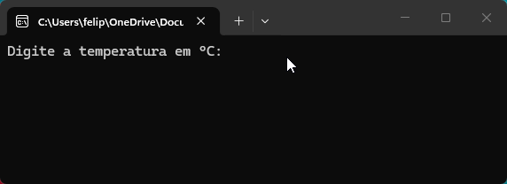
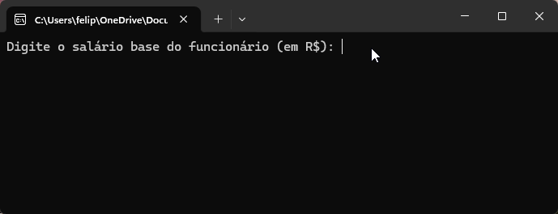
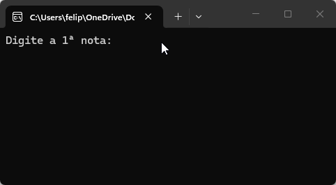

# Lista de Exercícios 01 - 02/04

## Primeira lista de exercícios realizada na [Academia do Programador](https://www.academiadoprogramador.net) 2026.

### 1. Crie um programa para calcular o volume de uma caixa retangular. ###

Fórmula para o cálculo do volume: *V = comprimento x largura x altura*;

 

### 2. Crie um programa que calcule o consumo de combustível por quilômetro percorrido em uma viagem. ###

Fórmula para o cálculo da média de consumo de combustível: 

*média de consumo de combustivel = kms Rodados / qtd Combustível utilizado durante a viagem*

 

### 3. Crie um programa para converter a temperatura da escala Celsius para a escala Fahrenheit ###

Fórmula para converter a temperatura de Fahrenheit para Celsius.

*tempFahrenheit = ((tempCelsius x 9) / 5) + 32*

 

### 4. Crie um programa para calcular o salário total de um vendedor. ### 

Deverá ser informado o salário base e o total de vendas. A comissão é calculada com um percentual (informado pelo usuário) sobre o total de vendas.

### 5. Crie um programa para calcular a média ponderada de duas provas realizadas por um aluno.

Fórmula para o cálculo da média ponderada:

*mediaPonderada = ((nota1 x peso1) + (nota2 x peso2)) / peso1 + peso2*

