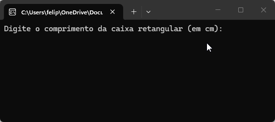
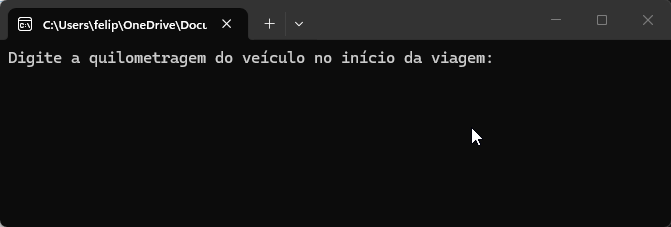

# Lista de Exercícios 01 - 02/04

## Primeira lista de exercícios realizada na [Academia do Programador](https://www.academiadoprogramador.net) 2026.

### 1. Crie um programa para calcular o volume de uma caixa retangular. ###

Fórmula para o cálculo do volume: *V = comprimento x largura x altura*;

 

### 2. Crie um programa que calcule o consumo de combustível por quilômetro percorrido em uma viagem. ###

Fórmula para o cálculo da média de consumo de combustível: 

*média de consumo de combustivel = kms Rodados / qtd Combustível utilizado durante a viagem*

 